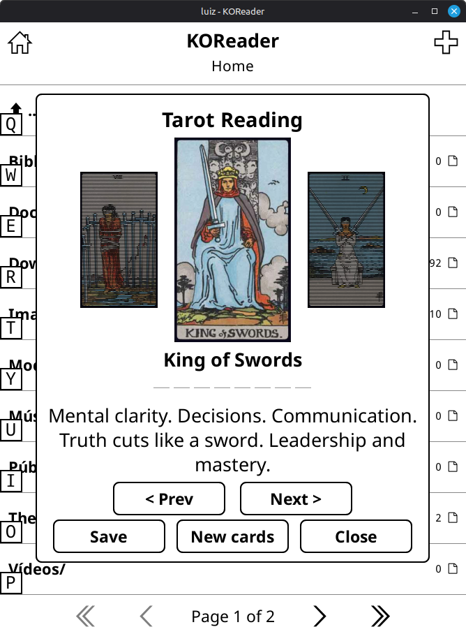

# Tarot para KOReader

Plugin de tarot e baralho cigano para KOReader. Ideal para introspecção durante a leitura. Desenvolvido com auxílio do DeepSeek.

  

## ✨ Funcionalidades

- **Carta Diária** — Uma carta baseada na data do dia para reflexão diária
- **1 Carta** — Carta aleatória com significado detalhado
- **3 Cartas** — Tiragem completa com navegação entre cartas
- **Carta Oculta** — Exibe o verso da carta antes de revelar a tiragem (pode ser desativado nas configurações)
- **Livro de Cartas** — Explore todas as cartas com nomes, símbolos e significados
- **Salvar tiragens** — Guarde com título e notas pessoais
- **Tiragens salvas** — Acesse ou exclua leituras anteriores
- **Tarot** (78 cartas) ou **Baralho Cigano** (36 cartas)
- **Cartas invertidas** — Ative ou desative
- **Apenas Arcanos Maiores** — Opção para sorteios mais diretos
- **Português e inglês**

## 📥 Instalação

Insira a pasta `tarot.koplugin` na pasta de plugins do KOReader. Reinicie o KOReader.

> ⚠️ Reinicie o KOReader ao mudar o idioma para aplicar corretamente.

## 🎴 Baralhos

- **Tarot** — 78 cartas (22 Arcanos Maiores + 56 Arcanos Menores)
- **Baralho Cigano** — 36 cartas do sistema Lenormand com símbolos únicos

## 📖 Livro de Cartas

Navegue por Arcanos Maiores, Menores (por naipes) e Baralho Cigano. Cada carta exibe nome, número, símbolo, significado e significado invertido. Ideal para estudo e consulta.

## 💾 Salvando uma tiragem

1. Após tirar as cartas, toque em **Salvar**
2. Insira um título e, se quiser, uma nota pessoal
3. A tiragem será salva automaticamente

## 📂 Acessando tiragens salvas

No menu principal, vá em **Tiragens Salvas** e escolha **Abrir no Leitor** ou **Excluir**.

## ⚙️ Configurações

- Escolha entre Tarot e Baralho Cigano
- Ative/desative cartas invertidas
- Mostre apenas Arcanos Maiores
- Ative/desative a **Carta Oculta** (verso antes da revelação)
- Alterne entre português e inglês
- Acesse o botão **Sobre** para informações dos baralhos e créditos das imagens

---

# Tarot for KOReader

Tarot and lenormand reading plugin for KOReader. Perfect for introspection while reading. Developed with the help of DeepSeek.

## ✨ Features

- **Daily Card** — A card based on the day's date for daily reflection
- **1 Card** — Random card with detailed meaning
- **3 Cards** — Full spread with card navigation
- **Hidden Card** — Shows card back before revealing the spread (can be disabled in settings)
- **Card Book** — Browse all cards with names, symbols and meanings
- **Save readings** — Save with title and personal notes
- **Saved readings** — Access or delete previous readings
- **Tarot** (78 cards) or **Lenormand** (36 cards)
- **Reversed cards** — Enable or disable
- **Major Arcana only** — Option for more direct draws
- **Portuguese and English**

## 📥 Installation

Place the `tarot.koplugin` folder into KOReader's plugins folder. Restart KOReader.

> ⚠️ Restart KOReader when switching languages for changes to take effect.

## 🎴 Decks

- **Tarot** — 78 cards (22 Major Arcana + 56 Minor Arcana)
- **Lenormand** — 36 cards with unique symbols

## 📖 Card Book

Browse Major Arcana, Minor Arcana (by suits) and Lenormand deck. Each card shows name, number, symbol, meaning and reversed meaning. Perfect for study and reference.

## 💾 Saving a reading

1. After drawing cards, tap **Save**
2. Enter a title and, optionally, a personal note
3. The reading will be saved automatically

## 📂 Accessing saved readings

In the main menu, go to **Saved Readings** and choose **Open in Reader** or **Delete**.

## ⚙️ Settings

- Choose between Tarot and Lenormand
- Enable/disable reversed cards
- Show only Major Arcana
- Enable/disable **Hidden Card** (card back before reveal)
- Switch between Portuguese and English
- Access the **About** button for deck information and image credits

---

## 🙏 Créditos das imagens / Image credits

- **Lenormand Cards** por Yve Lepkowski ([https://stolen-thyme.com/](https://stolen-thyme.com/))
- **Tarot Cards** por Luciella Elisabeth Scarlett ([https://luciellaes.itch.io/](https://luciellaes.itch.io/))
