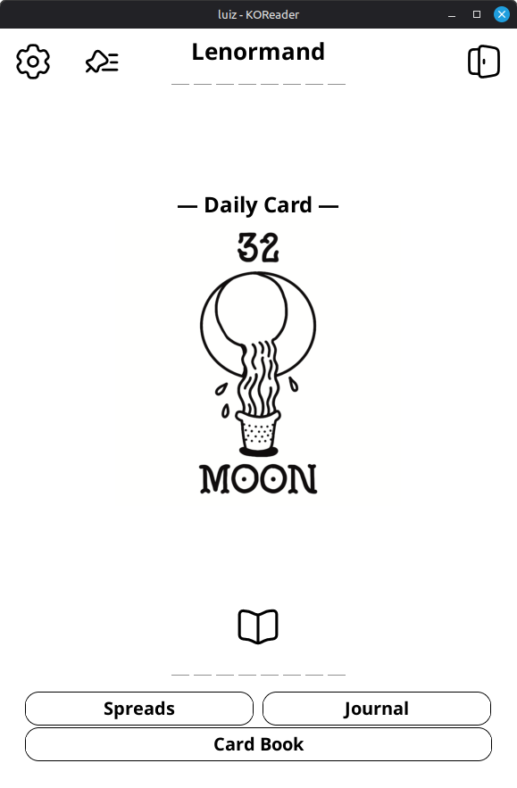

# Tarot for KOReader

A simple Tarot and Lenormand plugin for KOReader.

Draw cards, reveal meanings, save reflections, and browse the card book directly on your device.

<p align="center">   </p>

## Features

* Tarot and Lenormand support
* Daily Card
* Hidden Card spread with a 4x4 grid
* Readings with up to 16 cards
* Physical Deck mode
* Card Book with meanings
* Use book highlights as personal card meanings
* Reflection Journal
* Adaptive fullscreen layout
* E-ink friendly refresh options
* Translations in English, Portuguese, Brazilian Portuguese,Spanish and Chinese

## Installation

Unzip and copy the plugin folder to:

```text
koreader/plugins/
```

Then restart KOReader and open the plugin from the tools menu.

## Version

**Arcana - 5.12.3**

## Cards credits

* **Lenormand Cards** por Yve Lepkowski (https://stolen-thyme.com/)
* **Tarot Cards** por Luciella Elisabeth Scarlett (https://luciellaes.itch.io/)
